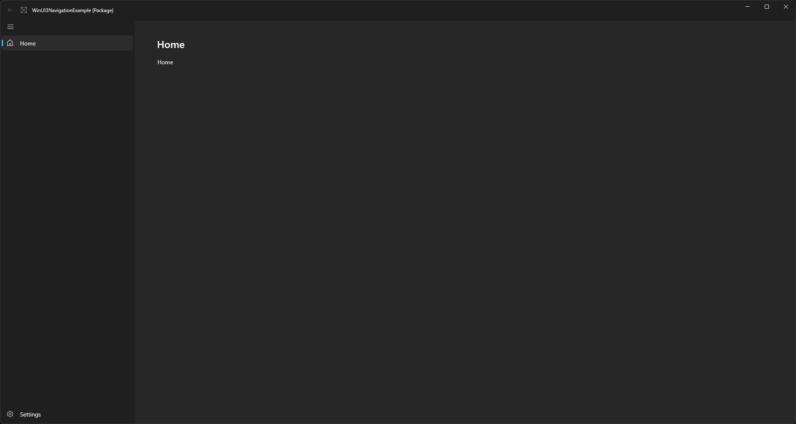

# WinUI 3 Navigation Example

## Introduction

Example of a WinUI 3 NavigationView application using the Windows 11 styles. 
On Windows 11 this should look identical to a comparable WinUI 2 UWP app. 

Updated to WindowsAppSDK 1.3 where Mica style and a custom TitleBar are now very easy to use.
If you need to use an older version check the WindowsAppSDK-1.1 branch



## How It Works

> [!IMPORTANT]
> Updated to WindowsAppSDK 1.3 where Mica style and a custom TitleBar are now very easy to use.
> If you need to use an older version check the WindowsAppSDK-1.1 branch

### Style
As of WindowsAppSDK 1.3 Mica styles are much easier. We can now use SystemBackdrop to enable Mica. 
The SetTitleBar method has also been fixed so that we no longer need to use WinRT Interop for our custom title bar.

#### Mica
[Mica Documentation](https://learn.microsoft.com/en-us/windows/apps/design/style/mica#how-to-use-mica)

Mica can be enabled by using SystemBackdrop in either the c# or xaml of the MainWindow. Both have been used in this example.

In MainWindow.xaml.cs
```c#
public MainWindow()
{
  ...
  SystemBackdrop = new MicaBackdrop()
      { Kind = MicaKind.Base };
```
Or in MainWindow.xaml
```xaml
<Window.SystemBackdrop>
    <MicaBackdrop Kind="Base"/>
</Window.SystemBackdrop>
```

#### Custom TitleBar
[Custom TitleBar Documentation](https://learn.microsoft.com/en-us/windows/apps/develop/title-bar?tabs=winui3)

```c#
public MainWindow()
{
  ...

  ExtendsContentIntoTitleBar = true;
  SetTitleBar(AppTitleBar);
}
```

We can then create space for a title bar in App.xaml
```xaml
<Thickness x:Key="NavigationViewContentMargin">0,48,0,0</Thickness>
```
And make the title bar transparent
```xaml
<SolidColorBrush x:Key="WindowCaptionBackground">Transparent</SolidColorBrush>
<SolidColorBrush x:Key="WindowCaptionBackgroundDisabled">Transparent</SolidColorBrush>
```

### Navigation

A simple navigation example is provided in the MainWindow files. This is based on the documentation but simplified somewhat by including the full addess of each page in the NavigationViewItem's Tag.
```xaml
<NavigationViewItem Icon="Home" Content="Home" Tag="WinUI3NavigationExample.Views.HomePage" />
```


